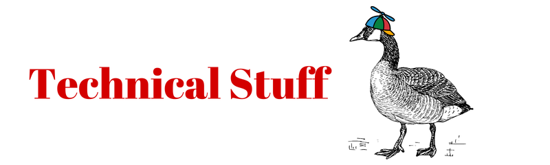

# TECHNICAL INTEL: UNDERSTANDING THE AT PROTOCOL

Gander is built on the AT Protocol (Authenticated Transfer Protocol). Unlike traditional social media platforms that act as "walled gardens," the AT Protocol is a decentralized network where you own your data. To navigate this landscape, you need to understand the technical markers that define your signal.

## Core Infrastructure

**AT Protocol (Authenticated Transfer Protocol)**: The "engine" of the network. It is an open-source set of rules that allows different social media servers to talk to each other, much like how different email providers (Gmail, Outlook) can exchange messages.

**PDS (Personal Data Server)**: Your "Home Base" in the Nest. A PDS is the server where your actual data (Honks, images, and social graph) is stored. Gander provides you with a PDS, but the protocol allows you to move your data to a different PDS without losing your followers.

**Relay (The Firehose)**: A large-scale service that crawls all PDS nodes to collect every new transmission. It acts as the network's "heartbeat," pumping data to the apps that display it.

## Identity Markers

**DID (Decentralized Identifier)**: Your permanent, cryptographic ID. While your "Handle" (like @user.gander.social) is human-readable and can be changed, your DID is a string of characters that never changes. It acts as your permanent "Passport" on the network.

**Handle**: Your human-readable alias (e.g., @michiel.gander.social). Handles are mapped to DIDs. You can even use your own web domain (like @yourname.ca) as your handle for the ultimate "Gold Standard" of verification.

**PLC (Placeholder)**: A specific type of DID directory used by the AT Protocol to manage how handles are mapped to IDs, ensuring that when you move your data, the network can still find you.

## The Viewing Lens

**AppView**: The service that organizes the "Firehose" of data into a format you can actually read. When you open the Gander app, you are interacting with an AppView that calculates your feed, likes, and notifications.

**Labeller**: An independent service (like [Ozone](https://github.com/bluesky-social/ozone/blob/main/docs/userguide.md)) that adds metadata to posts. Labellers are used for content warnings, fact-checking, and AI disclosure. You choose which labellers you trust in your settings. Gander is working on moderation based on Ozone.

## External Intel & Resources

For those who want to study the blueprints of the Nest, these external transmissions are highly recommended:

- [**The AT Protocol Official Site**](https://atproto.com/): The definitive technical documentation and specifications for the protocol itself.
- [**ATProto.com Docs**](https://atproto.com/docs): A deep dive into the architecture, including how PDS and Relays function.
- [**Bluesky Documentation**](https://bsky.social/about): Insights from the team that originally developed the AT Protocol.
- [**Ozone Moderation Documentation**](https://github.com/bluesky-social/ozone): Technical details on the tool Gander uses for community-led moderation and labelling.

## Glossary of Tactical Terms

If you're digging into the raw data or developer logs, you may encounter these more obscure frequency markers:

- **CID (Content Identifier)**: A unique "fingerprint" for a specific piece of content. Every Honk or image has a CID; if even one character of a post changes, the CID changes entirely. This ensures the integrity of the data.
- **Collection**: A group of similar records. For example, all your posts are in a app.bsky.feed.post collection, while your likes are in app.bsky.feed.like.
- **Federation**: The process by which independent servers (PDS nodes) connect and exchange information to form a single, unified network.
- **Lexicon**: The "dictionary" or schema that defines what a piece of data looks like. It tells the app how to display a "Honk" vs. a "Profile."
- **MST (Merkle Search Tree)**: The highly efficient data structure used to store your records. It allows the network to quickly verify that your data hasn't been tampered with.
- **Repo (Repository)**: The collection of all the signed records associated with your DID. When you move servers, you are essentially moving your "Repo" from one PDS to another.
- **Social Graph**: The mathematical map of who you follow, who follows you, and your block/mute lists. In the AT Protocol, you own this graph—it's not "rented" from the platform.

!!! info "The Sovereignty Principle"
    The most important takeaway: You are not the product. Because your identity (DID) is separate from your host (PDS), you have the right to leave a server at any time. This is called Account Portability.

!!! tip "Tactical Intel"
    If you ever see a technical error referring to your "DID" or "PDS Connectivity," it usually means there is a temporary "Signal Drift" between the Gander AppView and the network Relay. Usually, a quick refresh of the Nest will re-establish the handshake.