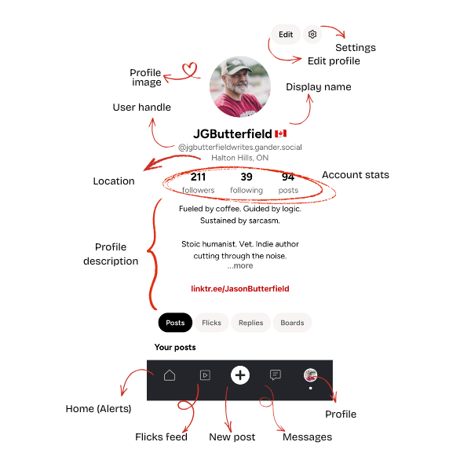
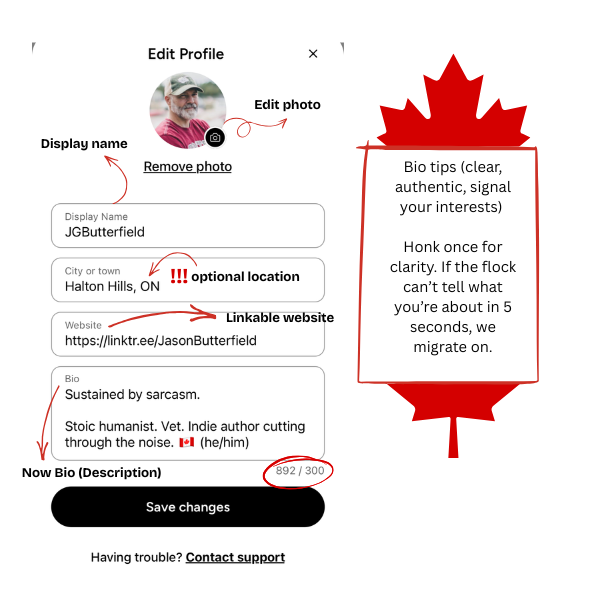
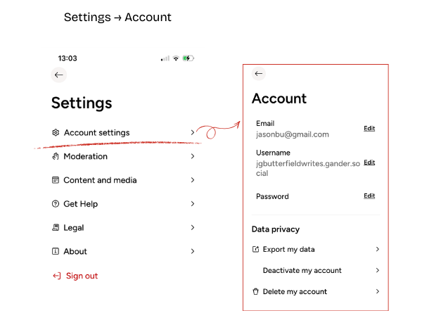

# JOINING THE FORMATION
---

!!! danger "UNOFFICIAL INTELLIGENCE"
    This guide is maintained by community volunteers. While we aim for accuracy, always cross-reference with [GanderSocial.ca](https://gandersocial.ca).

---

## :material-leaf-maple:Visual Identity

Your profile is your digital transponder in the Nest. Understanding these interface markers will help you navigate your own identity and engage with other members of the flock.

* **Profile Image:** Your visual signature in the Nest. Use a clear headshot or a clean brand logo if building a creator presence. This appears next to every **Honk** you emit.
* **Edit Profile:** Use this to update your bio, link your landing pages, or swap your profile image.
* **Settings (Gear Icon):** Access deep-level account configurations, notifications, and security protocols.
---
* **Display Name:** Your human-readable name. Unlike handles, this can include emojis and spaces to reflect your personality. You can change this at any time to reflect your evolving voice.
* **User Handle:** Your permanent `@address` on the AT Protocol. This is how the flock mentions you in conversation. While you can change it, switching your @handle after building visibility can disrupt how people find and tag you.
* **Account Stats:** A real-time readout of your **Followers**, those you are **Following**, and your total volume of **Honks (Posts)**.
* **Profile Description:** Your mission statement. Use this space to define your signal so others know why they should join your formation. You have up to 4000 characters. Use clear beats to signal your interests and help the right "flock" find you. Hyperlinks and emojis are permitted.

The bottom navigation bar is your primary tool for moving through Gander's sectors:

* **🏠 Home (Alerts):** Your primary dashboard for activity and community alerts.
* **▶️ Flicks Feed:** A dedicated stream for video-first transmissions and short-form visual content.
* **➕ New Honk (Post):** The central button to initiate a fresh transmission to the Nest.
* **💬 Messages:** Direct, encrypted communication lines between you and other individuals in the flock.
* **👤 Profile:** A quick shortcut back to your own command center to view your history and boards.

---

!!! tip "💡 TACTICAL TIP: POSTS VS. BOARDS"
    Just above the navigation bar, you can toggle between your **Honks (Posts)** and your **Boards**. While Honks are your chronological transmissions, **Boards** are curated folders where you can organize intel by topic for others to explore (coming soon).

### :material-leaf-maple:The Display Name VS Handle

In the Nest, your identity is split into two distinct layers. Understanding the difference is key to navigating the AT Protocol.

* **Display Name (The Mask):** This is your human-readable name (e.g., **J.G. Butterfield 🇨🇦**). It is purely cosmetic and can be changed at any time. You can use emojis, spaces, and special characters here to reflect your current mission or personality.
* **User Handle (The Transponder):** This is your permanent address (e.g., `@jgbutterfieldwrites.gander.social`).
* **The Technical Bit:** Because Gander is built on the **AT Protocol**, your handle acts as a unique pointer to your data.
* **Portability:** In the future, the AT Protocol allows you to move your "User Handle" and all your data to different servers (instances) without losing your followers or history.

!!! info "Tactical Summary"
    Your **Display Name** is how the flock sees you; your **Handle** is how the network finds you.

## :material-leaf-maple:Security & Recovery

Managing your transponder settings is critical for maintaining your presence in the Nest. Access these by tapping the **Gear Icon** on your profile.

### Account Commands

Navigate to **Settings → Account settings** to manage your core credentials:

* **Email Management:** View or update the primary contact address associated with your flock identity.
* **Username (Handle):** View your current `@handle.gander.social`. *Note: Changing this may affect how others find you on the AT Protocol.*
* **Password Control:** Initiate a secure reset of your access codes.

### Moderation

Navigate to **Settings → Moderation** to manage your blocklist:

* **Blockes Accounts:** View or update blocked accounts you've deemed not in your flock v-formation.

### Data Privacy
Gander emphasizes user sovereignty. In the **Data privacy** section, you have full control over your footprint:

* **Export My Data:** Download a complete archive of your transmissions, media, and social graph.
* **Deactivate Account:** Temporarily silence your signal. Your data remains on the server but is hidden from the public feed.
* **Delete Account:** Permanent termination of your identity and deletion of your data from the AT Protocol instance.

### Operational Oversight
The main Settings menu provides access to further mission-critical sectors:

* **Moderation:** Configure your content filters and manage blocked signals to keep your feed clean.
* **Content and Media:** Adjust how the Nest renders images and video to optimize for your current bandwidth.
* **Get Help / Legal:** Access official briefing documents and report technical "Signal Drift" to the dev team.

!!! warning "MISSION LOGOUT"
    To safely exit the app, use the **Sign out** command at the bottom of the Settings menu. Ensure you have your credentials saved, as the Nest requires a fresh handshake for every new session.

---

## :material-leaf-maple:Content & Media Preferences

Your experience in the Nest is customizable. Within the **Content and media** sector of your settings, you can toggle how the app handles transparency labels and third-party intel.

### Transperancy Toggles

Navigate to **Settings → Content and media** to adjust your viewing parameters:

* **Show labeled AI content:** * **ON:** Displays posts that creators have tagged as AI-generated. 
    * **OFF:** Silences transmissions with synthetic metadata, prioritizing purely human-made signal in your feed.

* **Show bias + fact-check ratings:** * **ON:** Displays third-party media bias and factuality labels on link previews (e.g., CBC ratings). 
    * **OFF:** Hides these labels for a cleaner, marker-free interface.

!!! info "The Verification Philosophy"
    Gander defaults these settings to **ON** to support the "Truth & Transparency" mission. Disabling these markers reduces your available intelligence on external links and synthetic content.

---

!!! danger "UNOFFICIAL BRIEFING"
    Data based on Release 1.0.1 (109).
    This is community-observed intelligence.

---