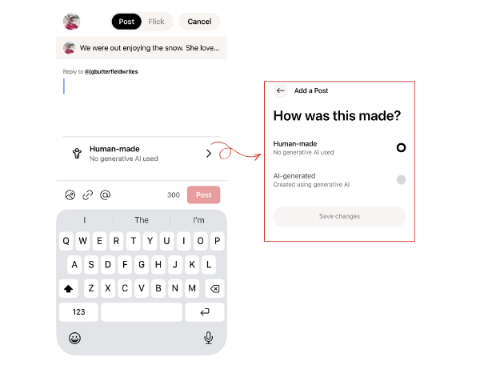
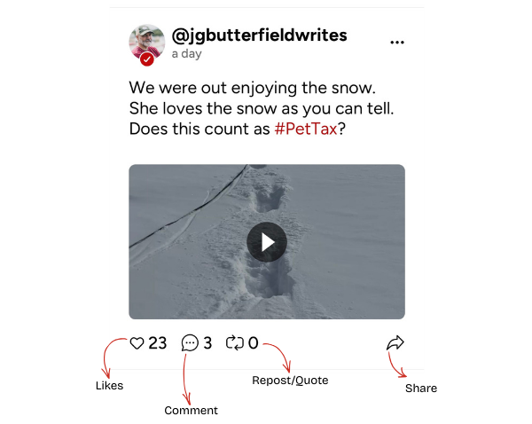
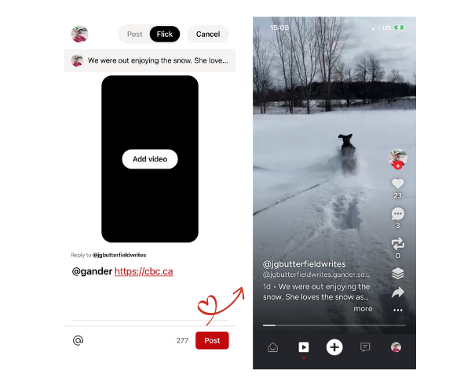

# FIELD MANEUVERS:

## INTERACTING WITH THE NEST

---

!!! danger "UNOFFICIAL INTELLIGENCE"
    This guide is maintained by community volunteers. While we aim for accuracy, always cross-reference with [GanderSocial.ca](https://gandersocial.ca).

---

## The Tramsmission(POSTING)

When initiating a new **Honk** (Post), you will see an attribution selector above your keyboard. This ensures your **Honk** carries the correct metadata for the community. There will be other tags for content in the future (so, we hear.)

  

* **Human-made:** Select this if your content was crafted entirely by you. It signals that no generative AI was used in the creation of the text or media.
* **AI-generated:** Select this if you utilized generative AI tools (like ChatGPT, Midjourney, etc.) to create or significantly alter the transmission.

### Why Disclosure Matters

Transparency is a core mission parameter. By tagging your content correctly, you help:
1. **Reduce Noise:** Allowing users to filter or prioritize human-to-human interaction.
2. **Establish Trust:** Building a reputation for honesty within your formation.
3. **Fact-Check Readiness:** Providing context for the community-led "Media Fact Check" systems.

!!! info "Tactical Tip: The Honk Workflow"
    Before you hit **Post**, get into the habit of checking your attribution. It only takes a second to switch between "Human-made" and "AI-generated," but it defines the integrity of your signal in the feed.

## Anatomy of a Honk
A **Honk** is more than just a post; it is a transmission to the Nest. Understanding the engagement markers allows you to amplify high-signal content and join the conversation effectively.

Every Honk in your feed includes specific metadata and interaction points:
* **Author Identity:** Displays the sender's profile image and `@handle`. A red checkmark indicates a verified community signal.
* **Timestamp:** Shows how long ago the transmission was emitted (e.g., "a day").
* **Content Area:** The primary payload—text, hashtags (like `#PetTax`), and media (images or video).
* **Extended Intel (Three Dots):** Access the sub-menu to report "Signal Drift," mute the sender, or copy the direct link to the transmission.

### Engagement
At the bottom of every Honk, you have four primary ways to interact with the flock:
* **🤍 Likes:** A simple acknowledgment of the signal. Tapping the heart increases the visibility of the transmission within the Nest.
* **💬 Comment:** Initiate a direct response or start a sub-thread. This is where the deepest community discourse happens.
* **🔁 Repost / Quote:** * **Repost:** Immediately amplify the signal to your own followers.
    * **Quote:** Add your own tactical context before passing the signal along.
* **🔗 Share:** Export the transmission to external networks or copy the link to your clipboard.
---

!!! info "The #Hashtag Strategy"
    Using hashtags like `#PetTax` or `#GanderBeta` isn't just for flair—it helps the search transponders categorize your intel so the right members of the flock can find it. And we all know you have to pay the `#PetTax`

## The "Timmies' Rule" (CONVERSATION)

We maintain a "sharing space" rather than a "noise" space.
- **Context is Queen:** If you share a link, add a short briefing above it explaining why it matters.
- **Thread Hygiene:** When replying, aim to improve the thread rather than inflaming it.
- **Mentions (@):** Tagging other flyers is an invitation to join the dialogue, not a summons for attention.

## Board Tactics: Curating the Nest
On Gander, you don't just "Honk" into the void, you organize your intelligence. **Boards** are curated folders that allow you to group transmissions by topic, project, or interest. Unlike a chronological feed, Boards are evergreen and provide a structured way for the flock to explore your content(currently it limited to your visability).

### Creating a New Formation
To establish a new Board, navigate to your profile and follow these tactical steps:
1. **Toggle to Boards:** Switch from your "Posts" (Honks) view to the **Boards** tab.
2. **Initialize:** Tap the **Add a board** button.
3. **Name the Sector:** In the "New Board" window, enter a concise title (e.g., *Field Manual*, *My Books*, or *Sector Intel*).
4. **Confirm:** Tap **Create Board** to deploy it to your profile.

### Archiving (ADDING HONKS)
Once a Board is active, you can save **honks** to it:
* **From your own Honks:** When creating or viewing your own or someone elses **Honks**, use the "Add to Board" prompt.
* **Organization:** You can add a single Honk to multiple Boards if the intel overlaps sectors. Simply check the boxes for the relevant Boards and hit **Save**.

### Why Boards Matter
Boards transform your profile from a simple timeline into a library of community value.
* **For Curators:** It allows you to showcase your best work or specific niche interests without them getting buried by new Honks.
* **For Followers:** In the future it'll make it easier for new members of the flock to "catch up" on specific topics you've covered in the past.

!!! tip "💡 Tactical Curation"
    Think of Boards like the chapters of a book. Use them to group your best #PetTax photos, your #IndieAuthor updates, or community guides like this one!

## Flicks

**Flicks** are Gander’s dedicated sector for short-form, vertical video **Honks**. Whether it’s a quick update from the field or a deep-dive report, Flicks allow you to share high-impact visual intel with the flock.

  

### 🎥 Flicks Parameters
To maintain signal quality and viewer engagement, Flicks must adhere to the following duration protocols:
* **Short Bursts (15 Seconds):** Ideal for quick "Pet Tax" check-ins, atmospheric captures, or rapid-fire alerts.
* **Deep Dives (Up to 3 Minutes):** Perfect for cinematic storytelling, technical tutorials, or detailed mission briefings. 

### Deploying a Flick
To initiate a video transmission, tap the **Plus (+)** icon in the navigation hub and toggle from "Post" to **"Flick"**:
1. **Add Video:** Tap the central upload area to select a vertical video from your device's archive.
2. **Add Intel:** Write a caption to provide context for your visual signal. Use @mentions (e.g., `@gander`) and relevant links to connect your Flick to the wider web.
3. **Tag Your Formation:** Use hashtags like `#Flicks` or `#FieldReport` to help the search transponders categorize your media.
4. **Post:** Hit the red **Post** button to broadcast your Flick to the feed.

### The Viewing Experience
When navigating the **Flicks Feed** (via the play icon in the bottom bar), you can interact with transmissions in real-time:
* **Vertical Immersion:** Flicks are designed for full-screen, vertical viewing.
* **Tactical Interaction:** Like, comment, or repost directly from the Flick overlay to amplify the signal.
* **Board Integration:** Just like standard Honks, high-value Flicks can be saved to your **Boards** for long-term curation and easy retrieval.

!!! info "The Gander Video Philosophy"
    Flicks aren't just about "content", they are about authentic, human-made windows into your world. Whether you're capturing the quiet of the North or the chaos of a project, keep your signal clear and your attribution honest.

---

!!! danger "UNOFFICIAL BRIEFING"
    Data based on Release 1.0.1 (109).
    This is community-observed intelligence.

---