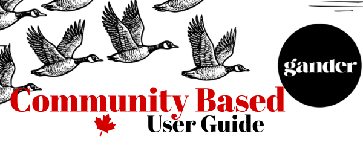

# Welcome to the Gander Intelligence Hub

!!! danger "CLASSIFIED: UNOFFICIAL INTELLIGENCE"
**This is NOT an officially sanctioned Gander Social manual.**
This hub is a civilian-led initiative produced by beta community members. While we aim for 100% accuracy in our intelligence, please refer to [GanderSocial.ca](https://gandersocial.ca) for official corporate communications.

> **"Social media that doesn't make you want to throw your phone into a lake."**

This is the central repository for all Gander Social operational data (really just a community managed guide). Whether you are a new user finding your wings or a veteran contributor helping us build the "Nest," you'll find everything you need here.

### Current Mission Parameters

- **Privacy First:** No tracking. No surveillance. Just community.
- **The AT Protocol:** Building on open-source foundations.
- **Community-Led Intelligence:** Built by beta testers who want to see the "Nest" succeed. We aren't the devs, we're the boots on the ground.

What else would you like to see in this guide? File a [**Report Signal Drift**](https://github.com/jasonbutt/gander-social-docs/issues/new/choose) here and let us know.

### Directory: The Flight Path

Select a sector below to begin your briefing:

- [**Join the Formation**](getting-started.md): How to get set up and establish your identity.
- [**Field Maneuvers**](how-to.md): Tactical app instructions for posting, links, and boards.
- [**Truth & Transparency**](transparency.md): Intelligence on our digital sovereignty and AI tagging.
- [**The Briefing Room**](briefing-room.md): Latest roadmap updates and beta release notes.
- [**The Field Manual**](contributing.md): How to contribute intel and fly in formation with this guide.
- [**Intel FAQ**](faq.md): Quick answers for common community queries.
- [**Report Signal Drift**](https://github.com/jasonbutt/gander-social-docs/issues/new/choose): Submit a User Guide bug report directly to the community hub.
