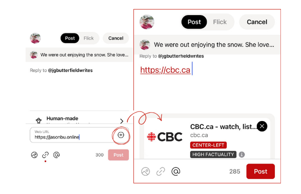

# 🛡️ TRUTH & TRANSPARENCY PROTOCOLS

!!! warning "INTELLIGENCE OBJECTIVE"
Gander Social is architected to respect data privacy by default and curb algorithmic chaos. These tools are the primary defenses against disinformation.

---

## MEDIA FACT CHECK INTEGRATION

One of Gander's most powerful tools is the integrated link preview system.

- **Verification:** When you post a link, the system checks the source against `mediafactcheck.com`.
- **Context Tags:** Preview cards may display bias ratings or fact-check results directly on the post.
- **Operational Tip:** A link without commentary is noise; always provide your own briefing to add value to the link's context.

## AUTHORSHIP DISCLOSURE (AI TAGS)

To maintain the integrity of the "Nest," transparency regarding how content is created is vital.

- **Human-Made:** This tag signifies no generative AI was used in the creation of the content.
- **AI-Generated:** Use this tag if generative AI tools assisted in the creation.
- **Signaling Trust:** This is not about policing creativity, but about signaling authorship so readers can understand the context.

## DIGITAL SOVEREIGNTY

As a community-led hub, we value where our data lives.

- **Canadian Servers:** All Gander data is hosted on sovereign Canadian servers (via ThinkOn), protected by Canadian laws.
- **The AT Protocol:** Gander is built on the same open, decentralized foundation as Bluesky, ensuring you aren't locked into a "surveillance-based" system.
